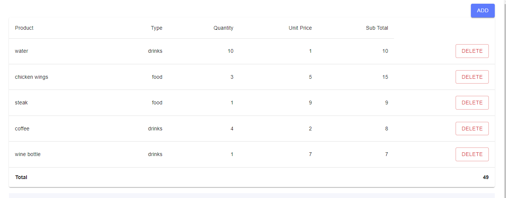
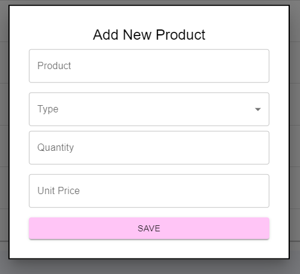
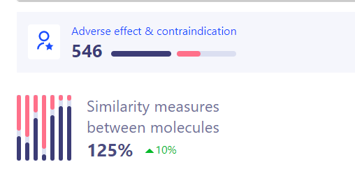
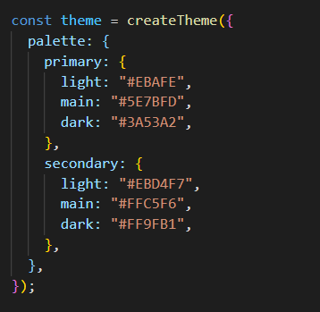
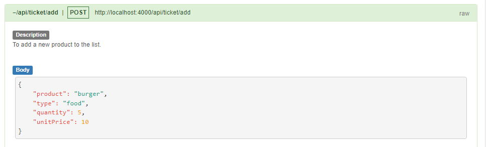
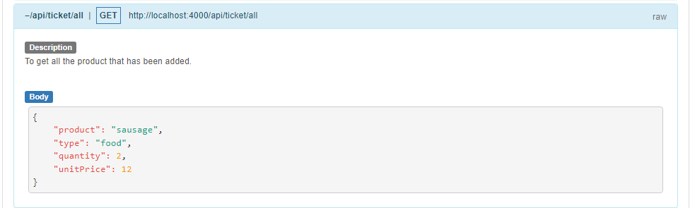
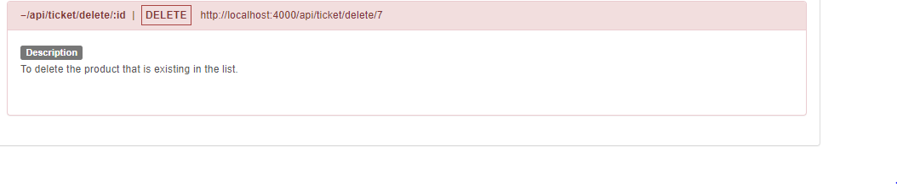

# FE_TE
Ticket Management System build using React, Material-UI and Node.js

## Tech

This application uses a number of open source projects to work properly:

- [React] - React is a free and open-source front-end JavaScript library for building user interfaces based on UI components.
- [Node.js] -  Node.js is an open-source, cross-platform, back-end JavaScript runtime environment that runs on the V8 engine and executes JavaScript code outside a web browser.

## Installation

Requires [Node.js](https://nodejs.org/) v10+ to run.

Install the dependencies and start the server.

```sh
cd backend
npm install
npm start
```

Simultaneously, you also need to start the client.

```sh
cd frontend/client
npm install
npm start
```

## Screenshot

##### Main


##### Add New Ticket


##### Two Components


##### Theme Added


# Backend
##### Add
Endpoint to add new ticket


##### Get All
Endpoint to get all ticket


##### Delete
Endpoint to delete ticket


